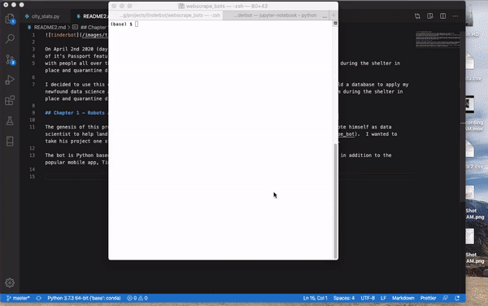
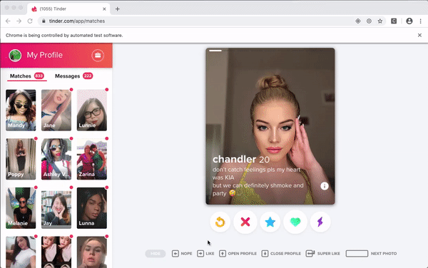
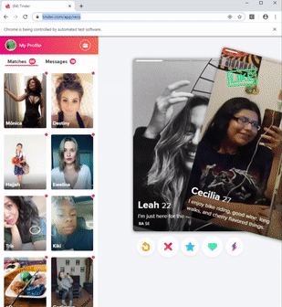
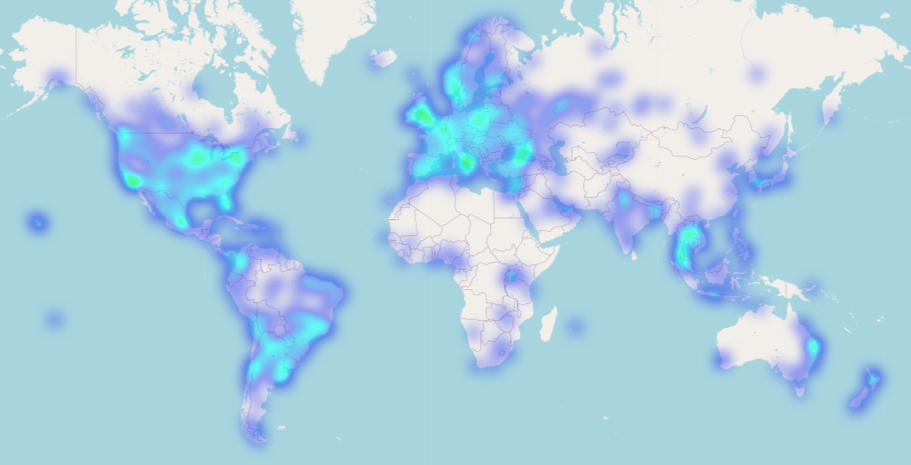
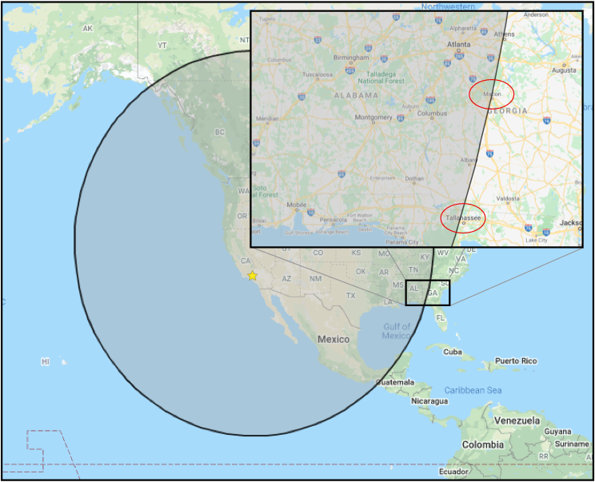
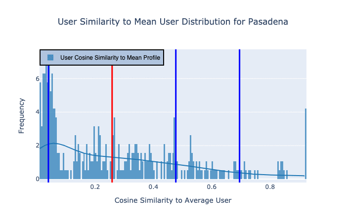

On April 2nd 2020 (day after April Fool's Day lol), Tinder announced that it will open up the use
of it's Passport feature to all Tinder users.  The Passport feature allows you to match
with people all over the world versus your immediate area in an attempt to combat lonliness and boredom during the shelter in place and quarantine directives being rolled out all over.

I decided to use this opportunity to gather Tinder profile information of users around the world to build a database to apply my newfound data science and analytical skills towards in an attempt to combat my own lonliness and boredom during the shelter in place and quarantine directives being rolled out all over.

## Chapter 1 - Robots Are Taking Our Jobs

The genesis of this project was heavily inspired by my friend who made a bot who's function was to promote himself as data scientist to help land him a job.  [Original project repository here](https://github.com/Aaronhjlee/swipe_bot).  I wanted to take his project one step further and webscrape the profile information of all the users it came across.

The bot is Python based and utilizes Selenium to run a WebDriver to simulate a user's session.  Luckily in addition to the popular mobile app, Tinder offers the same service on a computer internet browser.

I also found it funny that the good people at Tinder offer a "work mode" to help get in some swipes while on the clock.  I'm more of an Alt-Tab man myself tho.

From here, I wrote a series of subfunctions to automatically execute clicks and keystrokes to simulate swiping behaviors.  I also wrote a webscaping script that dives into the HTML to extract relavant information.  The Tinder web app UI is beautiful but incorporates a lot of JavaScript and non-intuitive class names which makes webscraping a moving target.  But where there's a will, there's a way.

I set my bot to the "equal opportunity" setting which swipes right (in the positive direction for the uninitiated) for everyone.  It is also the only setting it has.  In the event that I want to use Tinder for it's intended purposes, I would ideally like to train it with my personal preferences via a neural network.  But that sounds like a lot of labeled data and will be slated for the future.

Click on the image below quick video of the bot in action overlayed with Beyonce's hit "Single Ladies" song for obvious reasons:

[Link to video](https://streamable.com/bj5ps3)

(Note: Potential love of life alert at 0:23 of video)

Current limitations of the system is internet connectivity and system memory.  If the images do not load fast enough, the bot may skip a beat and record incomplete data.  And because the Tinder web app UI is a single page that is constantly fed new data, I believe that all the data is cached and never leaves - eventually eating up all your system memory and lagging things beyond functionality.  I ain't no web developer tho, just a hunch.  An expansion I would like to include one day is to run multiple instances of this bot on AWS EC2 in parallel to incorporate the power of cloud computing to my collection methods and not be limited to my 2012 MacBook.

All data per webscraping session is constantly saved and appended to a local .csv file that is later aggregated into a master file.  Eventually will be uploaded to Amazon RDS Postgres instance using Psycopg2 but we're not there yet.

The bot is what made the data collection possible.  Doing this manually would be insane.  I've used other methods like Beautiful Soup to webscrape static webpages ([shameless plug for my other rap based project](https://www.thwdesigns.com/what-we-talkin-bout)), but using Selenium for the first time to automate user sessions with credentials and actions is very cool.

## Chapter 2 - Initial Findings

I ran the bot overnight for about two weeks at the beginning of April 2020, roughly when COVID 19 started shutting everything down ([other shameless plug for my COVID19 based project](https://www.thwdesigns.com/united-states-of-covid)).  Here's an initial look at the overall dataset:

* 76,212 Total Profiles Gathered
* 75,609 ENTRIES HAVE AGE DATA (99.2%)
* 26,468 ENTRIES HAVE COLLEGE DATA (34.7%)
* 18,958 ENTRIES HAVE CITY DATA (24.9%)
* 18,822 ENTRIES HAVE JOB DATA (24.7%)
* 13,920 ENTRIES HAVE GENDER DATA (18.3%)
* 74,614 ENTRIES HAVE DISTANCE DATA (97.9%)
* 56,515 ENTRIES HAVE PROFILE DETAIL DATA (74.2%)
* 19,925 ENTRIES HAVE SPOTIFY ANTHEM DATA (26.1%)
* AVERAGE AGE IN DATA SET: 24
* NUMBER OF UNIQUE COLLEGES: 9719
* NUMBER OF UNIQUE JOBS: 11960
* NUMBER OF UNIQUE CITIES: 3413
* AVERAGE PICS PER PROFILE: 5

Quick discussion about the above:
* Age data is pretty self explanatory - but the ability to hide age is provided with the purchase of Tinder Plus, so if-so-fact-o (actually ipso facto in Latin lol), a minmum of 0.8% of women on Tinder flex with Plus?  You decide.
* About a third of users went to college / chose to add it to their profile.
* City data is relatively low (~25%), but fortunately I do have distance data of nearly all users.  Will do some calculations later to mathematically guesstimate the cities of the users with missing data.
* Approx a quarter of users chose to share their job with the most common being Student which is cool since Tinder started off on college campuses (thanks NPR How I Made This Podcast lol).
* About a fifth of users decided to explicitly list their gender.  Funnily enough the option is open-ended so the values range from specific LGBTQ definitions to others like "pizza" or "potato."
* Distance data is provided for most users but can also be hidden with Plus.  Ipso facto 2.1% are flexing here.
* Profile detail data is left blank for about 25% of the users.  This will be useful in later classification of "high effort" vs "low effort" profiles.
* A bit over a quarter of users choose to link the Spotify account and provide their "anthem."  Unsurprisinly "The Weekend" was the most chosen.  More on this later with genre clustering.
* There were ~3,400 unique cities in my dataset.  I used Geocoder to build a local location cache containing latitude/longitude info, state data (for USA), and country data for each city.

So Tinder Passport is pretty dope - here is a heatmap of the location of users my bot came across.  As you can see I was paired with users all over the world.  

Interactive version coming soon - needs to be hosted somewhere, maybe like heroku

However the majority of the data came from nearby local users in Los Angeles (which is where I was located during the data collection) so I.I.D. is out the window for the entire dataset.  However I think when we zoom into the city level outside the US, the datapoints are still chosen random enough to make insights about the population.

Below is the distribution of ages of the profiles in the dataset with a vertical line drawn at the mean age (24)

Now we have an idea of what the overall data looks like - let's dive into the contents of each.  

## Chapter 3 - Into the Nitty Gritty

Below is a word cloud of the details section across the entire dataset.

Huh, a LOT of Instagram mentions on Tinder.  Who woulda thunk.  I wonder if users are using their profiles in an attempt to grow their IG following to become a more influencial influencer.  Sounds like another project for another time.

In the meantime, I hand picked certain topics I was interested in and checked for keywords relating to that topic.  This list can be easily appended and expanded with future topics or keywords.

Topics Include:
* COVID-19 / Quarantine Mentions
* Instagram / Snapchat Mentions
* Alcohol Mentions
* Weed / Cannabis Mentions
* Raunchy Profiles
* Premium Snap Mentions
* Netflix / TV / Movies Mentions
* The Office Mentions

Of course these are all manually picked - I did some initial NLP Topic Modeling tests using Non-negative Matrix Factorization (NMF) but they came up non conclusive with no definitive topics being identified.  I believe it stems from the sparse profile detail data.  It would be great to automatically model topics per given slice of data (location / age / job / college/ etc.), but these will suffice for now.

Before getting into the top cities per topic, let's talk about filling in missing information.

As mentioned before, only ~25% of users specify their city on their profile.  To classify the remaining 75% with some degree of accuracy, I utilize the distance metric that is provided in nearly every profile ~98%.  Now I am able to estimate the city for a given profile based equal or similar distances (using the K-Nearest-Neighbors algorithm). 

For example, I have a profile with no city but is 1941 miles away from me.  Of the profiles with city information provided, 10 profiles are also precisely 1941 miles away from me.  Of the 10 profiles, 7 are based in Talahassee and 3 are based in Macon.  A random city is now chosen with 70% chance of being Talahassee and 30% of being Macon.  That city is then assigned to the blank city profile.  KNN method is used for blank city profile distances that are not explicitly in the list of distances in all profiles with provided cities.

Biggest caveat to this is the fact that ~75% of my city data is now based on the 25% of my original data.  Therefore when clustering my data via city, the accuracy will be affected.

### Here are your top 8 cities per category

Cities with less than 50 data points were excluded from the below results.
Percentages are calculated by dividing number of profiles with the particular mention in that city divided over the total number of profiles in that city.

Ex. College % - 59.3% of Tinder uses from Minneapolis display their college / university.

-----------HERE ARE YOUR TOP 8---------------

-----TOP 8 CITIES WITH MOST DATA ENTRIES-----
* Los Angeles    18,555
* New York        1,043
* Москва           870
* London           724
* São Paulo        678
* Bangkok          534
* Lima             519
* Pasadena         517

-----TOP 8 CITIES WITH HIGHEST COLLEGE %-----
* Minneapolis     59.3 %
* Johannesburg    53.7 %
* Jacksonville    53.5 %
* Ottawa          53.3 %
* Boston          52.7 %
* St. Louis       51.9 %
* Charlotte       50.9 %
* Tampa           48.8 %

-------TOP 8 CITIES WITH HIGHEST JOB %-------
* Culver City       44.0 %
* Montebello        40.3 %
* Portland          39.7 %
* Nashville         39.3 %
* Bristol           37.9 %
* Covina            37.7 %
* Minneapolis       37.2 %
* West Hollywood    36.1 %

------TOP 8 CITIES WITH HIGHEST ANTHEM %-----
* Cincinnati      47.89 %
* Pittsburgh      46.15 %
* Portland        44.83 %
* Glasgow         43.64 %
* Denver          43.33 %
* Sacramento      41.10 %
* Jacksonville    40.85 %
* Louisville      40.74 %

--------TOP 8 CITIES WITH HIGHEST IG %-------
* Pittsburgh    44.62 %
* El Paso       43.75 %
* Wrocław       41.54 %
* Toronto       38.26 %
* Portland      37.07 %
* Montréal      36.93 %
* Gold Coast    36.36 %
* Barcelona     36.26 %

-------TOP 8 CITIES WITH HIGHEST SNAP %------
* Pico Rivera     19.18 %
* Azusa           19.13 %
* Tulsa           17.65 %
* Baldwin Park    17.57 %
* Kansas City     16.88 %
* Sacramento      16.44 %
* Tucson          15.19 %
* Rosemead        14.86 %

-------TOP 8 CITIES WITH HIGHEST COVID %-----
* Lyon          13.11 %
* Surabaya      11.86 %
* Tulsa         11.76 %
* Halifax       11.48 %
* Cincinnati    11.27 %
* Richmond      11.11 %
* Nashville     10.11 %
* Chiang Mai    10.00 %

-------TOP 8 CITIES WITH HIGHEST WEED %-----
* Pomona           12.50 %
* La Verne          8.57 %
* Monrovia          7.46 %
* Paramount         7.14 %
* Cincinnati        7.04 %
* Riverside         6.85 %
* Monterey Park     6.41 %
* Covina            5.96 %

-------TOP 8 CITIES WITH HIGHEST ALCOHOL %-----
* Paramount        12.86 %
* Santo Domingo    11.11 %
* Richmond         11.11 %
* Halifax           9.84 %
* Wellington        9.62 %
* Lynwood           9.35 %
* Milan             9.26 %
* St. Louis         9.26 %

-------TOP 8 CITIES WITH HIGHEST TV %-----
* Richmond           11.11 %
* Huntington Park    10.61 %
* Birmingham         10.34 %
* San Jose            9.09 %
* Monrovia            8.96 %
* Tucson              8.86 %
* Washington          8.33 %
* Halifax             8.20 %

-------TOP 8 CITIES WITH HIGHEST Premium Snap %-----
* Compton         3.17 %
* Sacramento      2.74 %
* Detroit         2.67 %
* Nashville       2.25 %
* Philadelphia    1.94 %
* Ottawa          1.90 %
* Azusa           1.74 %
* Montréal        1.70 %

-------TOP 8 CITIES WITH HIGHEST OFFICE %-----
* Monrovia         2.99 %
* Riverside        2.74 %
* Beverly Hills    2.17 %
* West Covina      2.05 %
* La Puente        1.96 %
* Wellington       1.92 %
* Tel Aviv-Yafo    1.85 %
* Bandung          1.64 %

## Chapter 4 - How Not To Basic

Let's face it - it's a competitive world out there, and Tinder is no different.  Unfortunately, there is a lot of repetition and unoriginality present in profiles.  So the question is, - how can you make a profile that is different than all the other users in your city (aka your competition)?

This next analysis looks at users grouped by a specific city.  I take a look at the details portion of the profile and turn it into a mathematical vector that a computer can relate to rather than human "words."  Now that all users can be represented by vectors, I can take the average amongst population and compare the similarity of each user vector to the average.  After everything is compared, I can then take a look at the distribution and classify each user by number of standard deviations from the mean.  The further away the user is, the less like the other users they are.

Below is a GIF of the distribution of the top 8 cities with the most data points. 

The red line represents the mean, and the blue lines represent the standard deviations.

Next steps will be to apply Topic Modeling to the users near the mean, and also to those far away to determine if there are obvious differences in topics.

## Chapter 5 - Conclusions

Work thus far has only scratched the surface of what is possible with this dataset, but I've had fun gathering the data and analyzing it so far and will continue to work on it.

Future short term work includes:
* Additional slicing / clustering of data by different variables
* Improved data visualizations versus lists
* Interactive Dash App for users to filter data on their own
* Spotify API intergration for anthem analysis and popular genres per cluster

Future long term work includes:
* Applying computer vision to profile pictures
* Creating a trainable model with personal preferences

Hope you enjoyed looking at this project!  Any feedback is welcome - message me on [www.THWDesigns.com](www.THWDesigns.com)

